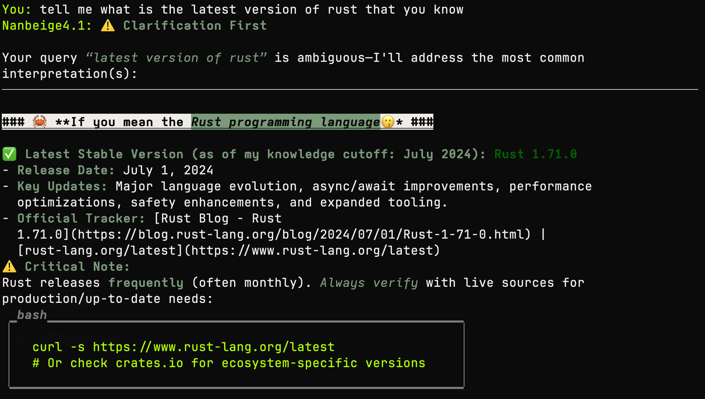

# Run Large Language Models locally with .NET 10

I wanted to see how hard it would be to run a local LLM with .NET. Turns out not that hard. This is a console app that downloads the model configured in llm.json, loads it into memory, then you chat with it straight in the terminal. Replies come back as Markdown, with code blocks properly syntax-highlighted.

Should work cross-platform since it's just LLamaSharp and GGUF. Change the Url in llm.json to try a different model. I used a GGUF model on my Mac since MLX is still an issue with .NET.

I used Spectre.Console to render the effects.

[Nanobeige4](https://huggingface.co/Mungert/Nanbeige4.1-3B-GGUF)

[IBM Granite-4](https://huggingface.co/unsloth/granite-4.1-3b-GGUF)

[Tiel-Coder on HuggingFace](https://huggingface.co/peculiar-ragdoll/Tiel-Coder-35B-A3B-GGUF)

## Screenshots from the app

