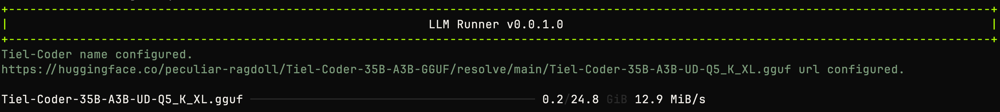
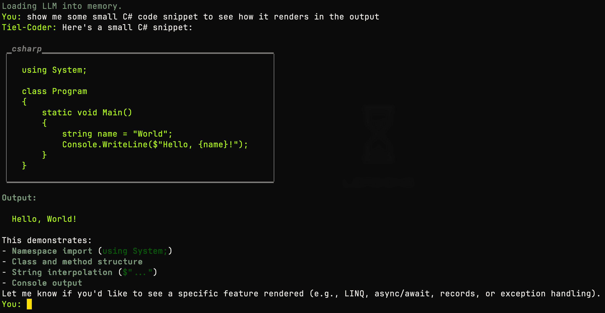

# Run LLM models locally with .NET 10

I wanted to see how difficult it would be to run a local LLM with .NET. Here's a basic implemenation using LLamaSharp and SemanticKernel which downloads the model configured in llm.json and then runs it locally to perform a simple chat with rendered Markdown. It's all handled via the Terminal so you can run the app and it does everything for you.

I used a GGUF model (MLX is an issue with .NET) to run it on my Mac. I believe this app is cross-platform with LLamaSharp and GGUF so you can replace the Url in llm.config to whatever model you want to try.

I used Spectre.Console to render the effects.

[Tiel-Coder on HuggingFace](https://huggingface.co/peculiar-ragdoll/Tiel-Coder-35B-A3B-GGUF/tree/main)

## Screenshots from the app

